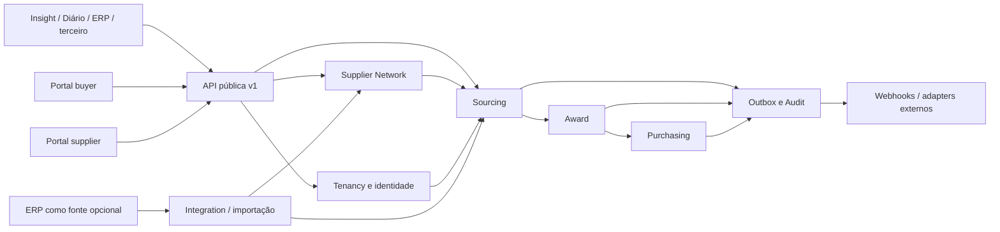

# Cotação Hub — arquitetura de domínio pré-G0 v2

**Estado:** proposta para revisão G0, sem autorização de implementação. Este documento substitui, para o futuro produto, os limites descritos em `docs/cotacao/**`; aqueles arquivos registram o plano anterior do módulo interno. Ao criar o repositório independente `cotacao-hub`, transferir este arquivo para `docs/architecture/overview.md` e manter a decisão rastreável.

## Fronteira do produto

O Cotação Hub é um monólito modular com API `/api/v1`, banco, armazenamento, chaves, portal buyer, portal supplier e jobs próprios. Ele é proprietário de cotações, participações de fornecedores, propostas, cortes, pedidos, documentos, notificações e trilha de auditoria. Insight Compras, Diário e outros sistemas apenas usam seus contratos públicos. Uma instalação deve completar a jornada com um cliente fictício sem acesso a Insight, Diário, Supabase compartilhado, Connectsoft ou cadastro específico de cliente.

O ERP pode ser fonte de cadastro de produtos, filiais e fornecedores para um tenant. A integração alimenta projeções e snapshots locais por API/importação. A indisponibilidade do ERP não pode impedir resposta, corte, emissão ou replay de uma cotação já criada. IDs externos são opacos e qualificados por `tenant_id`, `source_system` e tipo; nunca servem de chave interna ou FK de domínio.

## Bounded contexts e propriedade

| Contexto | Dono de | Contrato de saída | Não possui |
|---|---|---|---|
| Tenancy & Identity | tenant, aplicação, buyer actor, sessão, entitlement | contexto autenticado e escopos | cotação ou credencial do host |
| Supplier Network | organização global, usuário, membership, relação buyer × supplier | identidade e vínculo autorizado | oferta, preço de cotação ou identidade do buyer |
| Sourcing | cotação, item snapshot, participação, convite, proposta, revisão | revisão submetida e fechamento | regra de corte ou pedido |
| Award | política versionada, execução, alocação, intervenção | corte aprovado com snapshot e explicações | mutação da proposta, cadastro atual ou pedido |
| Purchasing | pedido, linha, número interno, revisão/emissão, aceite/recusa | eventos de ciclo de vida | `aprendizado_snapshot` ou número ERP como PK |
| Integration | namespace externo, importação, outbox, assinatura e entrega webhook | eventos públicos versionados | regras comerciais internas |
| Communications | templates, preferências, entrega e provedores | status de notificação | autenticação ou proposta |
| Audit | eventos imutáveis, ator, correlação, proveniência | consulta autorizada | fonte de verdade de estado operacional |

Os contextos se comunicam por portas de aplicação e eventos internos no mesmo processo. Transições críticas e outbox são persistidas em transação local. Nenhum contexto importa tabela privada de outro; projeções de leitura podem combinar dados por contrato interno. `AwardStrategy` recebe um pacote imutável de entradas, não consulta cadastro ou banco durante a avaliação. `ProductMatchingPolicy` é porta futura; o MVP usa ID do item e referência exata para importação. `NotificationProvider` é porta concreta desde o MVP, com e-mail como primeira implementação. Interfaces para otimizador global, catálogo universal e conector de ERP específico só surgem quando houver implementação real.

## Agregados e transações

- `Quotation` governa estado, prazo de resposta, revisão dos itens e lista de organizações participantes. Item criado guarda descrição, referência, marca, quantidade, unidade, destino e proveniência como snapshot. Mudança após abertura exige revisão e invalida cortes dependentes.
- `SupplierParticipation` tem identidade `(quotation_id, supplier_organization_id)` e é dona da `Offer` com cabeçalho comercial e linhas ofertadas. Muitos `Invitation` podem apontar à mesma participação; convite é comunicação/capability, não dono da proposta.
- `AwardRun` congela revisão da cotação, propostas, condições comerciais, política, estratégia, artefato/versionamento e saída. Ajuste humano cria nova revisão derivada, com ator e justificativa; execução anterior permanece.
- `PurchaseOrder` é agregado por fornecedor, destino e moeda, gerado de alocações aprovadas. Congela todos os dados necessários para revisão, emissão e auditoria. Cada pedido tem número Hub estável; referências ERP são anexos externos qualificados.

Uma aprovação de corte não deve competir silenciosamente com submissão nova: exige `If-Match` da cotação e fingerprint das revisões de proposta. Fechamento vence apenas se gravado primeiro; uma gravação do supplier concorrente recebe `412` ou `409` e não altera a revisão fechada. Emissão de pedido exige versão esperada e chave de idempotência; duas chamadas não geram dois pedidos ou dois eventos distintos. A janela exata de submissão usa hora do servidor e regra de deadline documentada na API.

## Invariantes transversais

### Identidade confiável e segurança

`TrustedIdentityProvider` é um registro de confiança controlado pelo Hub com `provider_id`, `type` (`oidc`, `jwt_jwks`, `hub_session`), `issuer`, `audience`, `key_source`/JWKS, `tenant_mapping`, `subject_mapping`, `role_mapping`, `enabled` e `policy_version`. O Hub valida assinatura, issuer, audience, tempo e chave antes de mapear ator e tenant. OIDC usa Authorization Code + PKCE; JWT/JWKS permite integrar hosts legados sem confiar em header, corpo ou token não registrado; `hub_session` é emitida após autenticação própria/federação. O Hub emite sessão própria para navegador e exige CSRF em mutações por cookie. Credencial M2M buyer não é entregue ao browser. Supplier M2M fica explicitamente pós-MVP e fora da API estável v1; alterações de oferta no MVP exigem ator supplier individual ou fluxo assistido com autoria buyer preservada. Os defaults, limites e regras de documento/evento constam em `docs/security/security-contracts.md`; a retenção por categoria está em `docs/security/data-retention.md`.

1. Tenant é derivado da credencial, nunca de `tenant_id` livre no corpo. Toda entidade tenant-scoped e cada operação de leitura/arquivo/evento é autorizada por tenant e recurso.
2. Organização fornecedora global é identidade mínima. Relação, contatos, códigos ERP, condições, score e histórico são privados do buyer. Deduplicação por CNPJ não autoriza mescla nem revela existência em outro tenant.
3. Nenhuma alteração de proposta ocorre sem ator individual identificável. Convite permite resgate limitado; sessão persistente depende de identidade e membership/concessão.
4. Dinheiro e quantidade usam decimal exato no domínio, banco e JSON. Unidade, moeda e base de preço precisam acompanhar comparação.
5. Dados que influenciam corte e pedido são snapshots imutáveis. Alterações posteriores em cadastro, proposta ou política não reescrevem decisões históricas.
6. Eventos saem da outbox no mínimo uma vez; consumidores deduplicam por ID. O Hub não faz chamada síncrona ao ERP no caminho crítico de corte ou emissão.
7. Entitlement mede uso por evento idempotente; plano ou limite não muda fatos comerciais já emitidos.

## Dependências permitidas e sequência

Tenancy e Supplier Network servem a Sourcing; Sourcing produz entrada congelada para Award; Award aprovado autoriza Purchasing; Integration, Communications e Audit observam fatos via outbox. Nenhum caminho de dependência volta de Purchasing para redefinir proposta ou corte. Insight e Diário só recebem eventos/API e mantêm adapters próprios depois que o Hub funcionar isoladamente.

## Necessário agora e extensibilidade

| Decisão | MVP | Contrato agora | Evolução posterior |
|---|---|---|---|
| Monólito modular e banco próprio | sim | limites e ownership | separar serviço somente por evidência operacional |
| Relação buyer × supplier | sim | isolamento, IDs externos | onboarding self-service avançado |
| Proposta e pedido com snapshots | sim | revisões e proveniência | negociação em múltiplas rodadas |
| `AwardStrategy` versionada | sim | entradas/saídas explicáveis | otimização global, concentração e custo total |
| Catálogo e matching | matching exato | porta de matching | equivalências/catálogos externos |
| ERP | importação/adapters opcionais | namespace e provenance | sync direta bidirecional por conector |
| Notificação | e-mail | porta de provedor | WhatsApp/API |

O G0 requer OpenAPI válido, fixtures executáveis, cenário comercial e revisões independentes. Este texto sozinho não aprova G0 nem libera H0–H7, I1 ou D1.
