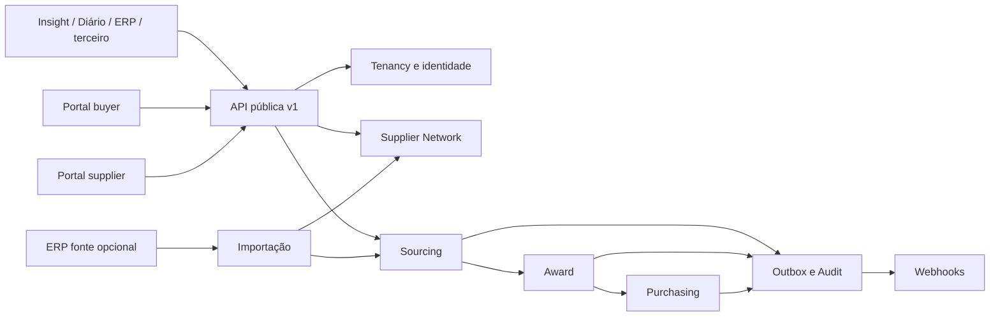

> **SUPERSEDED — NÃO UTILIZAR PARA IMPLEMENTAÇÃO.** Fonte vigente: `docs/SOURCE_OF_TRUTH.md`.

# Cotação Hub — revisão arquitetural pré-G0 v2

**Status final: G0 BLOCKED.** Revisão em 29/09/2026, branch local `codex/cotacao-pre-g0-v2` de `/Users/felipebarbosa/Code/insight-compras`, derivado de `origin/claude/plano-cotacao-multiagente`. Nenhum código funcional do Hub, H0–H7, I1 ou D1 foi iniciado. O repositório independente `cotacao-hub` ainda não foi criado; os documentos devem ser transferidos para ele após aprovação.

## 1. Alterações realizadas

Foram criados documentos de arquitetura, Sourcing, Supplier Network, Award, Purchasing, condições comerciais, segurança, matriz de papéis, jornadas buyer/supplier, escopo MVP, três ADRs, OpenAPI 3.1, fixtures `cliente-terceiro` e cenário dourado, plano multiagente v2 e relatórios de revisão. Os documentos C0–C9 anteriores foram marcados como históricos/suspensos. O plano antigo não autoriza migração no Supabase compartilhado.

## 2. Decisões novas

Proposta com cabeçalho comercial tipado e linhas com base de preço, unidade, mínimo, múltiplo, disponibilidade e alternativas; `requires_review` para preços sem base comparável. Faturamento mínimo e frete são avaliados por pedido fornecedor × destino. Pedido é preparado em `draft`, revisado e emitido depois. Convite de pedido e OTP dão delegação restrita para confirmação, sem reutilizar o convite de cotação. `TrustedIdentityProvider` abstrai OIDC, JWT/JWKS e sessão própria. API inclui operações em lote, importação assistida com autoria real, documentos e eventos tipados para pedidos.

## 3. Decisões descartadas e motivo

`Pedido = aprendizado_snapshot`, RPC do Diário no Supabase compartilhado, proposta por convite e token que lista cotações: criavam acoplamento ou acesso amplo. Menor preço unitário como vencedor automático: ignora embalagem, frete, faturamento mínimo e base fiscal. OIDC como único SSO: restringiria hospedeiros. Otimizador global, motor tributário, frete por faixa, marketplace e conectores específicos ficaram para evolução, para preservar o caminho do MVP.

## 4. Pontos mantidos

Hub independente, monólito modular, banco e infraestrutura próprios, API pública `/api/v1`, fornecedores globais com relações comerciais privadas por buyer, usuários individuais, convite limitado, decimal exato, corte versionado/reproduzível, `purchase_order` canônico, outbox/webhooks, entitlement. Insight e Diário são consumidores por adapters posteriores.

## 5. Achados por agente

| Agente | Achado principal | Veredito |
|---|---|
| A1 arquitetura | Limites e ownership definidos; manter Hub operável sem hosts | `APPROVE` da direção, condicionado ao G0 |
| A2 comercial | Unit price isolado não compara caixa, mínimo ou frete | Direção aprovada, condicionado ao OpenAPI/fixture |
| A3 decisão | Mínimo é restrição de pedido; FOB desconhecido exige revisão | Contrato Award aprovado, condicionado à prova |
| A4 API | 42 rotas, schemas, autenticação, bulk, pedido, importação, eventos | OpenAPI válido; prova semântica pendente |
| A5 segurança | Mandato supplier M2M, TTL/limites, retenção/LGPD e provas negativas pendentes | `BLOCKED` |
| A6 UX | Grade/bulk/autosave e cartões mobile necessários para cotação grande | Viável, condicionado aos contratos |
| A7 challenger | 31 chamadas Prism são smoke sem estado; achados P1 em custo por cenário e corridas | `BLOCKED` |
| A8 auditor | Faltam jornada encadeada, negações e quatro `APPROVE` formais | `BLOCKED` |

## 6. Riscos ainda existentes

`lowest_eligible_cost_by_item` precisa declarar hipótese de agrupamento/cenário quando mínimo e frete são por pedido. Reabertura da cotação deve serializar com pedidos `draft` e emissão. Pedido baseado em resposta assistida precisa regra tipada de confirmação ou exceção. Os eventos anunciados além de `purchase_order.issued.v1` e `.confirmed.v1` precisam payloads tipados ou marcação experimental. Segurança precisa fechar mandato de credencial supplier, perfis do provedor de identidade, TTL/rate limits, retenção/LGPD e autorização de eventos/documentos. A fixture precisa encadear respostas, IDs, ETags, sessão, retries e negações T1/T2.

## 7. MVP × pós-MVP

| Capacidade | MVP | Pós-MVP | Contrato agora |
|---|---|---|---|
| Cotação, supplier, OTP, convite, resposta, bulk e XLSX | Sim | integração direta supplier | Sim |
| Condições comerciais, mínimo/múltiplo, frete conhecido, corte explicável | Sim | otimizador global, motor tributário, frete por faixa | Sim |
| Pedido, PDF/XLSX, e-mail, auditoria, API, outbox/webhooks | Sim | WhatsApp oficial, billing | Sim |
| Adapters Insight/Diário | Após Hub isolado, no MVP integrado | outros ERPs | API/SSO/eventos |
| Catálogo universal, ranking inteligente, marketplace | Não | Sim | apenas fronteira futura justificada |

## 8. Diagrama atualizado

## 9. Resumo do OpenAPI

`openapi/cotacao-hub-v1.yaml` é OpenAPI 3.1 com 42 rotas: token M2M/SSO, suppliers, cotações e itens bulk, convites/OTP, propostas e importações, políticas/execuções de corte e snapshot, pedidos draft/revisão/emissão/convite/confirmação, documentos, webhooks, eventos e uso. Define decimal em string, `Idempotency-Key`, `If-Match`/ETag, erros, paginação e payloads tipados para dois eventos de pedido. `openapi-spec-validator` retornou `OK`.

## 10. Fixture cliente-terceiro

`contracts/examples/cliente-terceiro/README.md` descreve vinte passos sem SQL, Insight, Diário ou banco compartilhado. Prism 5.16 gerado do OpenAPI, em modo dinâmico `--errors`, recebeu 31 chamadas HTTP de `run_mock.py`; todas retornaram 2xx declarados. Resultado salvo em `mock-result.txt`. **Limite:** o mock não mantém estado e o script usa corpos mínimos, IDs/ETags/segredos fixos; não comprova fluxo encadeado, negações, idempotência, assinatura ou decisões.

## 11. Cenário dourado

Fixture sintética com 2 tenants, 3 suppliers, 2 filiais em Q1 e 12 itens totais. Política P1 prepara B/F1 por BRL 631,50 e B/F2 por BRL 258,00, total BRL 889,50; I06 (2), I10 (3) e I11 (1) ficam pendentes. O caso cobre mínimo A de BRL 1.500,00, múltiplo C de 10, frete fixo, marcas/referências alternativas, empate, parcial, sem estoque, sem resposta e autoria assistida. `verify.py` passou aritmética Decimal e probes comerciais. Não executa `AwardStrategy` real, que pertence ao G1.

## 12. Vereditos e portão

Arquitetura, domínio comercial e Award aprovaram a direção com condições. Segurança: `BLOCKED`. API: OpenAPI válido, sem `APPROVE` independente formal. Challenger: `BLOCKED`. Auditor: `BLOCKED`. Assim, **G0 BLOCKED**. Os pareceres completos estão em `.agents/orchestrator_cotacao/reviews/` e o portão em `.agents/orchestrator_cotacao/GATE_STATUS.md` no branch de planejamento.

## 13. Próximo trabalho necessário antes de novo G0

Fechar os achados P1 de contrato; construir fixture contratual encadeada e negativa, ainda sem produto; revalidar OpenAPI e cenário; obter `APPROVE` explícito de reviewers de arquitetura, domínio, segurança e API; repetir challenger e auditor até `CLEAN`. Só depois apresentar `G0 READY` para revisão humana. Não iniciar implementação automaticamente.
